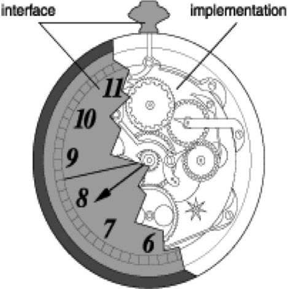

# OC多文件开发介绍
##本小节知识点:
1. 【了解】为什么要使用多文件
2. 【理解】@interface和@implementation的分工
3. 【理解】在OC中如何进行多文件开发？
4. 【了解】使用多文件开发好处

---

##1.为什么要使用多文件
- 一个真正的iOS项目中可能会有成百上类，如果这些类都写在一个文件中，那么文件就会很大，想找到自己需要类都变的异常困难，开发效率低下

- 一个iOS项目可能会有多个人开发，如果多个人同时修改一个文件，那么就很可能会产生冲突，比如这个增加一个方法，那个人把这方法删掉了。另外就是当把多个人写功能合并起来的时候，也非常困难，写到一个文件中，无法顺畅的进行团队合作。

---

##2.@interface和@implementation的分工
- @interface就好像暴露在外面的时钟表面
- @implementation就好像隐藏在时钟内部的构造实现



---

##3.在OC中如何进行多文件开发？
- 在工作中,通常把不同的类放到不同的文件中,每个类的声明和实现分开
    + 声明写在.h头文件中,
    + 实现写在相应的.m文件中去,
    + 类名是什么,文件名就是什么。
```objc
假设有两个类,分别是Person类和Dog类,则通常有下面五个文件:
(1)Person.h Person类的声明文件
(2)Person.m Person类的实现文件
(3)Dog.h Dog类的声明文件
(4)Dog.m Dog类的实现文件
(5)Main.m 主函数(程序入口) 在主函数以及类的实现文件中要使用#import包含相应的头文件。
```
---

##4.使用多文件开发好处
- 显著提高团队协作的效率
- 提高程序的开发速度
- 提高程序的可维护性
- 提高代码的可读性

---
